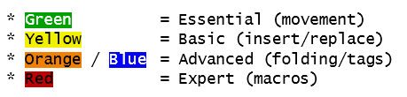

# Vim Cheat Sheet for Programmers

When I was learning Vim I wanted to know a few things:

* How are keys grouped by functionality?
* What keys are free to re-use?
* How do I set sane defaults for editing code?

## Screen (150 dpi)

## Print (600 dpi)

* [vim_cheat_sheet_for_programmers_print_600dpi.png](vim_cheat_sheet_for_programmers_print_600dpi.png)

The color coded Legend / Keys helps provide guidance for your experience level.

# Older Versions

## 2.3

* [2.3 pdf](old_2.3/vim_cheat_sheet_for_programmers_print.pdf)
* [2.3 png](old_2.3/vim_cheat_sheet_for_programmers_print.png)
* [2.3 xls](old_2.3/vim_cheat_sheet_for_programmers_print.xlsx)

## 2.0

* [2.0 pdf](old_2.0/vim_cheat_sheet_for_programmers_print.pdf)
* [2.0 pdf](old_2.0/vim_cheat_sheet_for_programmers_print.png)
* [2.0 xls](old_2.0/vim_cheat_sheet_for_programmers_print.xlsx)

# Other cheat sheets / references

* http://www.viemu.com/a_vi_vim_graphical_cheat_sheet_tutorial.html
* http://tnerual.eriogerg.free.fr/vim.html
* http://www.lagmonster.org/docs/vi.html
* http://jrmiii.com/2009/03/06/learning-vim-the-pragmatic-way.html
* https://vim.rtorr.com/
* https://devhints.io/vim
